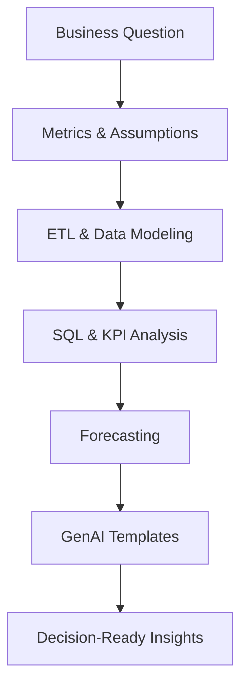

## Hi, I’m Mita 👋

Data Analytics & Engineering professional with hands-on experience building ETL pipelines, product analytics workflows, forecasting baselines, and GenAI-enabled tools. I focus on translating ambiguous business questions into clear, maintainable data solutions that teams can trust.

**Focus:** Data Engineering • Product Analytics • Forecasting • Applied GenAI (Prompt Engineering)

---

### How My Work Flows

---

### Areas of Focus
- **Data Engineering:** Designing modular, config-driven pipelines with validation and testing
- **Product & Business Analytics:** Defining KPIs, writing SQL-first analyses, validating results in Python
- **Forecasting & Data Science:** Using interpretable baselines before introducing complex models
- **Applied GenAI:** Prompt engineering, ambiguity handling, and guardrail-driven analytics assistants

---

### Tool Stack
**Languages:**  Python, SQL  

**Data & Analytics:**  Pandas, NumPy, Jupyter  

**Big Data & Warehousing:**  Google BigQuery, SQL-based analytics on large datasets  

**Visualization & BI:**  Tableau, Power BI, Excel  

**Data Engineering & Cloud:**  Git/GitHub, YAML-based configs, modular pipelines  
AWS (S3, Glue, Redshift – exposure)  

**GenAI & AI Concepts:**  Prompt engineering, prompt templates, ambiguity handling, guardrails, CLI-based tooling  

---

### How I Work
- Partner with **product managers, analysts, and engineers** to clarify requirements
- Convert vague business questions into **explicit metrics and assumptions**
- Prioritize **readability, reproducibility, and safety** over over-engineering
- Comfortable operating in **cross-functional, fast-paced environments**

---

### Selected Projects
- **Scalable Data Pipeline** — config-driven ETL with validation and tests  
- **Product Analytics (SQL + Python)** — KPI design with runnable examples  
- **Forecasting Experiments** — baseline forecasting and evaluation mindset  
- **GenAI Analytics Assistant** — natural language → SQL templates with guardrails

📌 Repositories are pinned below  

