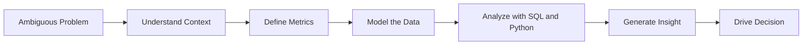

  

# Hi, I’m Mita 👋

I work with data, but I care more about what it represents: people, decisions, and the stories we often miss when we only look at numbers.

Somewhere between analytics, engineering, and product thinking, I’ve found my space : taking messy, unclear problems and slowly shaping them into something structured, meaningful, and useful.

---

### 🧠 How I Think About Data

```mermaid
flowchart LR
    A[Ambiguous Problem]
    B[Understand Context]
    C[Define Metrics]
    D[Model the Data]
    E[Analyze with SQL and Python]
    F[Generate Insight]
    G[Drive Decision]

    A --> B --> C --> D --> E --> F --> G
```
---

### 🌱 What that has looked like in practice

Over time, I’ve worked on problems where the data wasn’t perfect, but the impact mattered.

Contributing to supply chain decisions that led to $1.5M+ in cost savings, improving lead conversion by 40% by understanding user behavior, designing experiments that helped teams move forward with confidence, and building data systems that people can actually trust and use.

---

### 🧠 How I approach problems

I don’t jump straight into SQL or models.

I like to sit with the problem first, understand what we’re really trying to answer, what success looks like, and what assumptions we might be making.

From there, things tend to flow like this:

question → metrics → data model → pipelines → analysis → insight → decision

---

### ⚙️ What I spend most of my time doing

Working on product and business analytics, defining meaningful metrics, understanding user behavior, and breaking down vague questions into something measurable.

Building data pipelines and modeling layers, using approaches like star and snowflake schemas to make data easier to work with.

Exploring forecasting and decision-making, starting simple and keeping things interpretable.

And more recently, working with GenAI — thinking about prompts, structure, and how to make analytics workflows more intuitive.

---

### 🧩 Things I’ve built

A data modeling project comparing star and snowflake schemas, a scalable ETL pipeline with validation and modular design, product analytics work combining SQL and Python, A/B testing frameworks for experimentation, forecasting projects grounded in business context, and a GenAI - powered analytics assistant.

---

### 🛠️ Tools I’m comfortable with

Python (pandas, NumPy), SQL, Jupyter, Snowflake, BigQuery, Tableau, Power BI, Excel, AWS (S3, Glue, Redshift)

---

### 🌿 How I like to work

With clarity, curiosity, and empathy.

I try to understand the people using the data, not just the data itself, and I care about building solutions that are not only correct, but also usable, simple, and maintainable.

---

### ✨ Currently

Exploring opportunities in data analytics, product analytics, data science, and analytics engineering.

Always open to conversations, ideas, and building something meaningful 🚀
